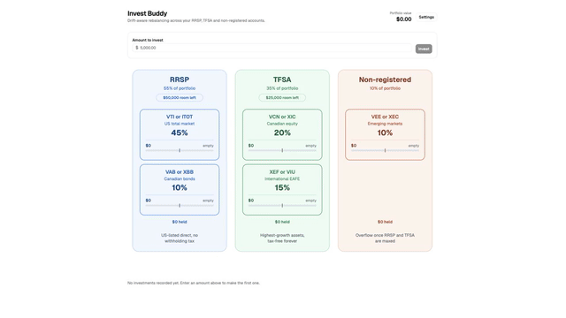

# Invest Buddy

A rebalancing calculator for a fixed Canadian couch-potato ETF allocation across
an RRSP, a TFSA and a non-registered account.

You type in how much you want to invest. The app works out where the money should
go, shows it landing on the allocation diagram, and records it so the next
deposit accounts for what you already hold.



## Structure

Each account (RRSP, TFSA, non-registered — or any labels you choose) holds one or
more sleeves, and each sleeve holds one or more assets, each with its own ticker,
holding, and target share of the sleeve. The full three-level hierarchy — **Account
→ Sleeve → Asset** — is editable: add, rename, reorder, and delete at any level from
the **Edit** view, reachable via the Plan/Edit toggle at the top of the page. The
**Plan** view is where you type a deposit and watch it land.

A fresh database starts with an empty portfolio; that empty state offers a **Load
example portfolio** button (also `POST /api/presets/example`) that loads the
account/sleeve/asset tree described below.

## The allocation

This is the shape of the built-in example portfolio — your own accounts, sleeves,
and assets can look however you like. Weights are percentages of the **total**
portfolio and sum to 100.

| Sleeve                | Tickers     | Target | Account         |
| --------------------- | ----------- | -----: | --------------- |
| US total market       | VTI or ITOT |    45% | RRSP            |
| Canadian bonds        | VAB or XBB  |    10% | RRSP            |
| Canadian equity       | VCN or XIC  |    20% | TFSA            |
| International (EAFE)  | XEF or VIU  |    15% | TFSA            |
| Emerging markets      | VEE or XEC  |    10% | Non-registered  |

## How deposits are split

**Drift-aware cash-flow rebalancing.** A deposit does not get carved up by the
fixed target weights. It flows to whichever assets sit furthest *below* their
target, pulling the portfolio back toward the targets without ever selling
anything.

For each asset the engine computes how far below target it would sit once the
deposit lands, clamps that at zero so overweight assets get nothing, and splits
the deposit in proportion to those shortfalls. When nothing is overweight the
shortfalls sum to exactly the deposit, so every asset lands precisely on target.

**Contribution room caps, and does not redirect.** If a deposit would push the
RRSP or TFSA past its remaining room, that account's lines are scaled down to
fit and the blocked remainder is reported as unallocated cash for you to place
yourself. It is never silently moved to another account.

All money is handled as integer cents with largest-remainder rounding, so the
lines always sum to exactly the deposit.

## Running it

Requires Node 20+, pnpm, and PostgreSQL running locally.

```bash
pnpm install

# One-time: create the database and bring it up to date.
pnpm db:reset

pnpm dev          # api on :3001, web on :5173
```

Point at a different database with `DATABASE_URL`.

### First run

`pnpm db:reset` recreates the database from the migrations in `server/db/migrations/`,
so the app starts with an empty portfolio. From there, either build your accounts,
sleeves, and assets by hand in the **Edit** view, or click **Load example portfolio**
on the empty-state screen to load the RRSP/TFSA/non-registered tree described above.

Applying a new migration to an existing database (without wiping it) is `pnpm db:migrate`.

Whichever way you start, set your real contribution room and any balances you
already hold from the **Edit** view: the edit icon on an account opens its account
dialog, which is where the contribution-room field lives now (the old Settings
dialog is gone). **If you loaded the example portfolio, its room figures are
placeholders, not real CRA limits.**

## Connecting to the database with psql

The app connects to `postgresql://localhost:5432/invest_buddy` by default, with no
username or password — a stock local PostgreSQL install authenticates you as your
own OS user. Override it with `DATABASE_URL` if your setup differs.

```bash
psql -d invest_buddy
```

### If psql is not found

Homebrew keeps PostgreSQL keg-only, so its binaries are installed but left off your
PATH. Add them for the current shell:

```bash
# Apple Silicon; use /usr/local/opt on Intel, and match your installed version.
export PATH="/opt/homebrew/opt/postgresql@18/bin:$PATH"
```

Make it permanent by appending that line to `~/.zshrc`. To find the right path for
your machine:

```bash
brew --prefix postgresql@18   # then append /bin
```

Check the server is actually up before assuming a connection problem:

```bash
pg_isready                 # expects: /tmp:5432 - accepting connections
brew services list         # shows whether postgresql@18 is started
```

None of the project's `pnpm db:*` scripts need this: they reach Postgres through
`pg`, not the `psql` binary. The PATH fix only matters for running `psql`
interactively.

### Useful queries

Every money column is stored as **integer cents**, and `target_bps` is in basis
points (10000 = 100%). Divide when reading them by hand.

Current holdings against their targets (holdings live on `assets` now, not `sleeves`):

```sql
SELECT a.ticker,
       (s.target_bps / 100.0)::numeric(5,2)     AS sleeve_target_pct,
       (a.holding_cents / 100.0)::numeric(14,2) AS holding
  FROM assets a
  JOIN sleeves s ON s.id = a.sleeve_id
 ORDER BY s.sort_order, a.sort_order;
```

Contribution room, with usage derived from the ledger the same way the API derives
it (`room_limit` is NULL for non-registered, meaning no limit). `investment_lines`
now references `assets` directly, so joining back to an account goes through both
`assets` and `sleeves`:

```sql
SELECT acc.label,
       (acc.room_limit / 100.0)::numeric(14,2)                   AS room_limit,
       (COALESCE(SUM(l.amount_cents), 0) / 100.0)::numeric(14,2) AS used
  FROM accounts acc
  LEFT JOIN sleeves s ON s.account_id = acc.id
  LEFT JOIN assets a ON a.sleeve_id = s.id
  LEFT JOIN investment_lines l ON l.asset_id = a.id
 GROUP BY acc.label, acc.room_limit, acc.sort_order
 ORDER BY acc.sort_order;
```

Investment history, newest first:

```sql
SELECT i.id,
       i.created_at,
       (i.requested_cents / 100.0)::numeric(14,2)   AS requested,
       (i.unallocated_cents / 100.0)::numeric(14,2) AS held_back_as_cash
  FROM investments i
 ORDER BY i.id DESC;
```

Schema reference: `\dt` lists the five tables (`accounts`, `sleeves`, `assets`,
`investments`, `investment_lines`), `\d assets` describes one. The schema is
defined in `server/db/schema.ts`; generated SQL lives in `server/db/migrations/`.

### Resetting

`pnpm db:reset` drops and recreates the database, then replays every migration.
**It destroys all recorded investments and holdings** and leaves the portfolio
empty. Use the app's "Load example portfolio" button (or
`POST /api/presets/example`) afterwards to get the example data back.

### Changing the schema

1. Edit `server/db/schema.ts`.
2. `pnpm db:generate` — writes a new SQL file under `server/db/migrations/`.
3. Read the generated SQL and commit it with the schema change.
4. `pnpm db:migrate` to apply it to your local database (or `pnpm db:reset` to
   rebuild from scratch).

CI runs `pnpm db:check`, which fails if `schema.ts` changed without a matching
migration.


## Scripts

| Script           | What it does                                     |
| ---------------- | ------------------------------------------------ |
| `pnpm dev`       | API and web dev server together                  |
| `pnpm test`      | Full unit test suite (needs local Postgres)      |
| `pnpm test:watch`| Same suite in watch mode                         |
| `pnpm lint`      | oxlint; any warning fails the run                |
| `pnpm typecheck` | Typecheck client and server                      |
| `pnpm build`     | Production build                                 |
| `pnpm db:reset`  | Drop the database, recreate it, and replay all migrations (portfolio starts empty) |
| `pnpm db:generate`| Generate a migration from changes to `server/db/schema.ts` |
| `pnpm db:migrate`| Apply pending migrations to `DATABASE_URL` |
| `pnpm db:check`  | Verify `server/db/schema.ts` and the committed migrations agree (regenerates and fails on any diff) |

## Tests

```bash
pnpm test
```

Around 150 tests covering the rebalancing engine, money parsing and formatting,
diagram geometry, the portfolio reader and every API endpoint. No React rendering
tests — the logic those components rely on is covered directly.

**The server tests need a running local PostgreSQL.** They do not touch your
`invest_buddy` database: `server/test/db.ts` creates a throwaway database per test
file and brings it up to date with the generated Drizzle migrations, loads the
example account/sleeve/asset tree (`server/presets/example.ts`) into it where a
test needs starting data, and drops the database afterwards. It connects through
`pg` rather than shelling out to `createdb`, so it does not need `psql` on your
PATH. Set `DATABASE_URL` to point the tests at a different server.

The API tests run against `createApp(pool)` via supertest without binding a port,
which is why `server/index.ts` is only an entrypoint and all the routes live in
`server/app.ts`.

## Contributing

`main` is pull-request-only: a repository ruleset blocks direct pushes, force-pushes
and deletions, and holds the merge button until the `ci` workflow is green. That
applies to everyone, including the repo owner — there is no bypass list.

CI runs `pnpm lint`, `pnpm typecheck`, `pnpm test` and `pnpm build` on every PR,
with PostgreSQL supplied as a service container so the database-backed tests run
for real.

One-time setup in a fresh clone, so a mistaken `git push origin main` is caught
locally instead of by the server:

```bash
git config core.hooksPath .githooks
```

Git does not share hooks through a clone, and `core.hooksPath` is per-clone
configuration, so this cannot be automated away without a dependency.

## Layout

```
shared/         rebalance.ts — the engine, plus its tests. Pure, no I/O.
                types.ts     — contracts shared by API and client.
server/         app.ts       — createApp(db): every route, Drizzle instance injected.
                index.ts     — entrypoint: builds the db and listens.
                portfolio.ts — reads portfolio state out of Postgres.
                presets/example.ts — the opt-in example account/sleeve/asset tree.
                db/          — schema.ts, migrations/, connection pool, reset script.
                test/db.ts   — throwaway database for tests.
src/            App.tsx      — page shell, amount input, invest flow, Plan/Edit toggle.
                components/EmptyState.tsx — first-run screen when the portfolio is empty.
                components/editor/  — the Edit view: account/sleeve/asset CRUD.
                components/diagram/ — the SVG allocation diagram.
                lib/         — API client and money formatting.
```

The client previews a deposit by running the same engine the server runs, so the
diagram and the write can never disagree. The server still re-plans
authoritatively inside a transaction against locked rows, so a stale preview can
never write the wrong amounts.

## Caveats

- This is a bookkeeping and arithmetic tool. It does not place trades, read your
  brokerage, or know current prices — holdings are book values you and it record
  together.
- It is not financial advice.
